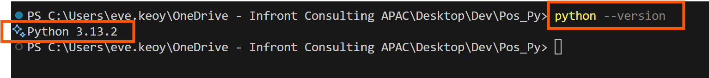
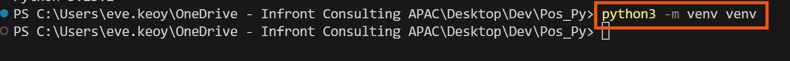
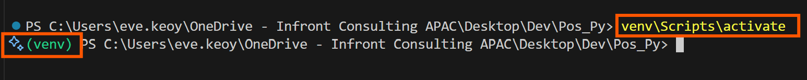
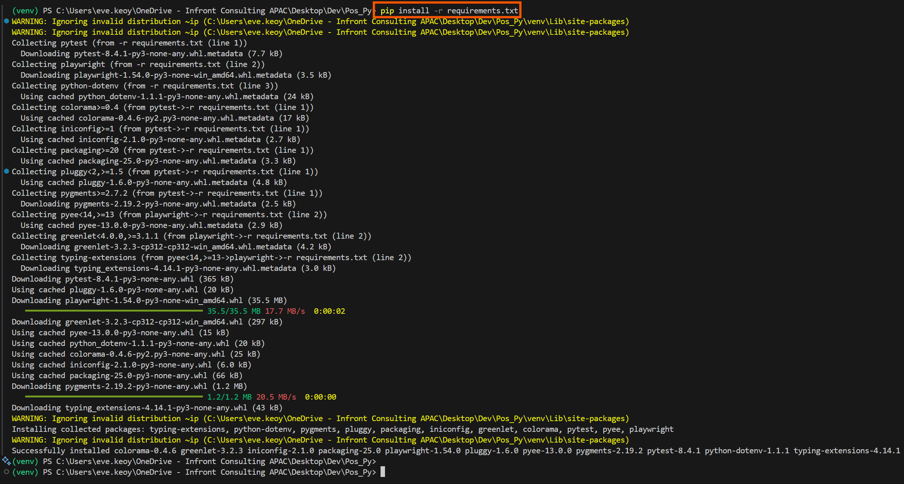
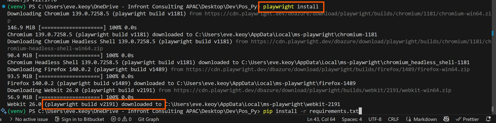

# Pos_Py
Take Home API Testing And Test Automation

# 🐍 PYTHON PLAYWRIGHT 🎭

# POS MALAYSIA #

## WHAT DOES THIS PROJECT DO

## PYTHON BEST PRACTICE
Python's Naming Convention (PEP 8) are summarized below:

| Element	| Convention | Example |
|----------|----------|----------|
Script/Module names | snake_case | customer_api.py
Functions | snake_case | get_customer_data()
Variables | snake_case | customer_id
Classes | PascalCase | CustomerAPI
Constants | SCREAMING_SNAKE_CASE | MAX_RETRIES
Methods | snake_case | calculate_total()
Private variables | _snake_case	| _internal_data
Name-mangled variables | __snake_case | __private_data
Packages | lowercase | mypackage
Type variables | PascalCase	| T, ResponseType

- PEP 8 Official Guide https://peps.python.org/pep-0008/
- Python Documentation https://docs.python.org/3/tutorial/classes.html#private-variables 
- Playwright Documentation https://playwright.dev/python/docs/api/class-playwright

## TO SETUP
1) Install python3.exe x64-bit.
Verify success installation of Python (v3 in our case): python --version or python3 --version

2) At root project create new virtual env, naming our virtual env as venv: python -m venv venv

3) Start Python's virtual env: venv\Scripts\activate 

4) python.exe -m pip install --upgrade pip
5) pip install -r requirements.txt

6) playwright install -will include this in a shell script soon

6) to end venv environment: deactivate
7) to run playwright/test, refer instructions below.

## TO RUN TEST
1) python tests/e2e/.py
2) python tests/regression/example_module.py

## [PRIORITY 1] helper.py FUNCTIONS TO DEVELOP... 
1) Scroll behavior: click and drag, example: start position 25%:25% end position 75%:75%
2) Screenshot at every page and save, with auto-rename.
3) Screenshot at FAILED page and save, with auto-rename.
4) page.wait_for_timeout() default to 2000 (milliseconds)
5) Payment Method: FPX, Mastercard, Visa

## [PRIORITY 2] test.py (main executable script, like PHP index)
1) python arguments: python test.py test_name_example.py --data csvfile 
2) map or init all e2e test scripts
3) setup .env for: payment detail, personal email, password, URL?? etc

## [PRIORITY 3] Questions and Problems to solve
1) how to launch multiple test scripts/windows parrallelly
2) playwright pytest configuration approach? at conftest?
3) scale playwright --headless=false to flexi, or 1/4 of window size
4) video evidence quality is SO BAD now.. can improve quality/size?

## [PRIORITY 4] SANITY TESTING
1) Login negative scenairos for all modules. Format, eligibility, with the error message.
2) screenshot every test case result!

## [PRIORITY 5] SELF EXPLORATION
1) email test result
2) test result template

## [PRIORITY 6] TEST PRE-REQUISITE - as this is possible to be done via backend only, no need UI
1) FAAS FPX & CC are stable
2) All involved MOLI API are stable
3) test data is valid. this requirement is tied, dependent, and conditional according to the module/product being tested can create table? for each module. allows new login? allows existing login? allows supplementary login? allows prepaid login? allows supplementary login? Digi is considered new user? Celcom is considered new user? Digi is considered existing user? Celcom is considered existing user?  1==TRUE, 2==FALSE. 
4) connect to db :D