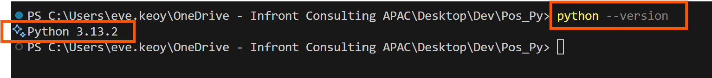
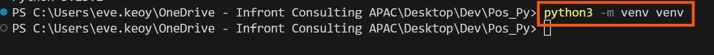
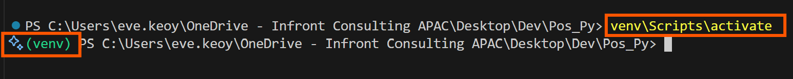
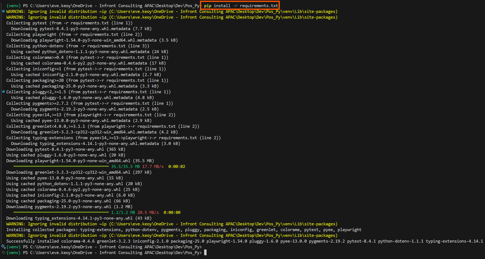
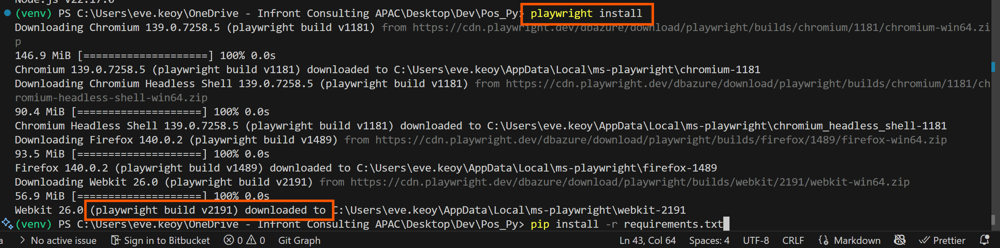

# 🐍 PYTHON PLAYWRIGHT 🎭
Pos_Py - POS MALAYSIA
Take Home API Testing And Test Automation

## WHAT DOES THIS PROJECT DO
1) 

## PYTHON BEST PRACTICE
Python's Naming Convention (PEP 8) are summarized below:

| Element	| Convention | Example |
|----------|----------|----------|
Script/Module names | snake_case | customer_api.py
Functions | snake_case | get_customer_data()
Variables | snake_case | customer_id
Classes | PascalCase | CustomerAPI
Constants | SCREAMING_SNAKE_CASE | MAX_RETRIES
Methods | snake_case | calculate_total()
Private variables | _snake_case	| _internal_data
Name-mangled variables | __snake_case | __private_data
Packages | lowercase | mypackage
Type variables | PascalCase	| T, ResponseType

- PEP 8 Official Guide https://peps.python.org/pep-0008/
- Python Documentation https://docs.python.org/3/tutorial/classes.html#private-variables 
- Playwright Documentation https://playwright.dev/python/docs/api/class-playwright

## TO SETUP
1) Install python3.exe x64-bit.
Verify success installation of Python (v3 in our case): python --version or python3 --version

2) At root project create new virtual env, naming our virtual env as venv: python -m venv venv

3) Start Python's virtual env: venv\Scripts\activate 

4) python.exe -m pip install --upgrade pip
5) pip install -r requirements.txt

6) playwright install

7) At root project, create .env file:
8) to end venv environment: deactivate
9) to run playwright/test, refer instructions below.

## TO RUN TEST
1) python tests/scripts/test_rate_calculator.py
2) python tests/scripts/test_example_page.py

## PLAYWRIGHT CODEGEN
playwright codegen https://url/here

## FOLDER ARCHITECTURE EXPLANATION: MVC
| MVC Role	| Purpose in MVC | Equivalent in this test | Explanation
|----------|----------|----------|----------|
Model (M) | Business logic, data handling | api/ folder (API calls, DB utils) | These handle data, such as fetching or validating from APIs, similar to the Model layer in MVC.
View (V) | UI components, rendering output | pages/ folder (Playwright functions sorted by pages and elements/components) | These represent the UI elements — input fields, buttons, dropdowns — and interact with them.
Controller (C) | Manages flow between M and V | scripts/ folder (test execution flow) | This orchestrates everything — when to click, when to fetch data, how to assert — like a controller.
